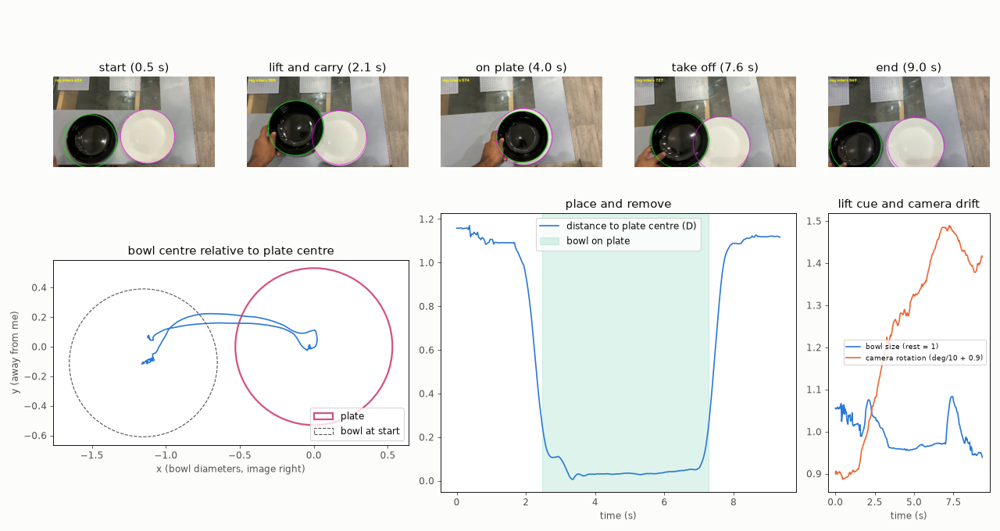

# Copy the Bowl, Not the Hand

**From two iPhone clips of my own hands to a robot policy in LIBERO, by imitating what happened to the object instead of how my hand moved.**


The standard way to use human video is to retarget the hand's trajectory onto the robot. On my data that fails completely: the Panda's gripper is not a hand, my phone gives no hand height, and a motion that slides a bowl for me tips it over or pushes it the wrong way for the robot (**0 / 50** successes).

This project uses my video for two other things:

1. **The goal**: the bowl's own trajectory (where it went, whether it was lifted), measured from the video.
2. **The strategy**: *where* on the rim my hand gripped the bowl, relative to the direction it moved.

The robot then searches for its own way to reproduce that effect, and the successful searches are distilled into a fast closed-loop policy. The human strategy is not decoration. **Policies trained on demos guided by it succeed 87.6% of the time, versus 63.6% without it** (3 training seeds, 450 held-out episodes each).


---

## Contents
- [The data I collected](#the-data-i-collected)
- [Method](#method)
- [Results](#results)
- [Reproducing](#reproducing)
- [Repository layout](#repository-layout)
- [Limitations and honest notes](#limitations-and-honest-notes)

## The data I collected

All recordings were made on an **iPhone 15 Plus** (no LiDAR), top-down over a kitchen table, 4K at 30 fps. Downscaled, silent copies are in [`data/clips/`](data/clips).

| Clip | What happens | Camera |
|---|---|---|
| [`scenario1_right_hand.mp4`](data/clips/scenario1_right_hand.mp4) | right hand slides a black bowl 0.43 bowl-diameters away | fixed |
| [`scenario1_left_hand.mp4`](data/clips/scenario1_left_hand.mp4) | left hand slides it back 0.41 bowl-diameters | fixed |
| [`scenario2_bowl_onto_plate.mp4`](data/clips/scenario2_bowl_onto_plate.mp4) | left hand lifts the bowl onto a plate, then takes it off again | **hand-held** (drifts, rotates up to 6°) |

Scenario 2 is the real-world version of LIBERO's own task `libero_goal` #8, *"put the bowl on the plate"*.

## Method

```
iPhone video ─┬─► hand landmarks (MediaPipe)          ──► baseline: replay the hand motion
              │
              └─► object track, no depth sensor:
                    bowl = dark-blob circle fit, plate = bright-blob circle fit
                    metric scale from the bowl's own size; lift from its apparent growth
                    hand-held camera: ORB + RANSAC registration, plate as fixed reference
                          │
                          ▼
              INTENT  =  goal (bowl displacement / bowl-on-plate)
                       + strategy (grip angle on the rim, relative to motion; lift height)
                          │
                          ▼
              CEM planner over manipulation primitives in LIBERO (push / pinch-drag / pick-place),
              human strategy as the search prior, parallel MuJoCo rollouts
                          │
                          ▼
              300 verified demos  ──►  policy (state MLP with action chunking, 0.7 ms per step)
                                  ──►  vision policy (SmolVLA fine-tuned from cameras only)
```

**Why the strategy transfers.** In both scenario-1 clips my hand gripped the rim about 100° clockwise from the direction the bowl moved (−115° and −84°), on opposite sides of the bowl and with opposite hands. Expressed relative to the motion, the same strategy applies to any start position and goal. The planner starts its search there, so its demos consistently use one strategy (pinch the rim: 278/300) instead of a mix (199 pinch, 91 inside-drag, 10 push without the prior). A regression policy cannot average three different strategies into a working one, so the consistent data distils far better.

Units throughout are **bowl diameters (D)**. This removes the unknown real bowl size and lets a human motion map onto LIBERO's 11.2 cm bowl.

## Results

### Scenario 1: slide the bowl (custom LIBERO scene: table, Panda, LIBERO's black bowl)

| Method | Uses from my video | Success, held-out tasks |
|---|---|---|
| Replay my hand motion (best of 3 gripper heights) | hand trajectory + grip | **0 / 50** |
| Intent planner, no human prior | goal | 40 / 40 (≈ 9 s of search per episode) |
| Intent planner, human prior | goal + strategy | 40 / 40, always the human-like pinch |
| Policy distilled from no-prior demos | goal | **63.6% ± 0.3** (3 seeds × 150) |
| **Policy distilled from human-prior demos** | **goal + strategy** | **87.6% ± 1.4** (3 seeds × 150) |

Per test set (pooled over seeds): random goals 79% vs 58%, right-clip goal 87% vs 67%, left-clip goal 96% vs 65%. The 95% Wilson intervals of the two pooled rates (80–91% vs 56–71%) do not overlap. A live run in the interactive viewer reproduced the gap independently (**100/113 vs 56/81**).

The success criterion is that the bowl ends within 0.1 D (about 1.1 cm) of the goal and upright. The policy runs at 0.7 ms per query, about 10,000× faster than planning.

### Scenario 2: put the bowl on the plate (LIBERO's official scene and success check)



From the hand-held clip, with camera drift removed: the bowl is lifted (it appears about 8.5% larger at the top of the carry), carried in an arc, and set down **0.006 D** from the plate centre. It sits there for 4.8 s and is then removed the same way. My hand gripped the **same near-left rim** in both directions, so here the strategy depends on where the hand comes from, not on the motion direction.

| Method | Success on LIBERO's official initial states |
|---|---|
| Replay my hand motion (fitted onto LIBERO's bowl and plate, lift from video, 3 heights × 10 starts) | **0 / 30** |
| One pick-place using my grip angle (114°) and lift (≈4 cm) directly, no search | ✓ first try (init state 0) |
| Same pick-place with a naive grip on the side facing the robot (180°) | ✗ misses the bowl |
| Intent planner with / without my grip prior | *in progress* |

### Vision policy (in progress)

SmolVLA (`lerobot/smolvla_base`, 450M parameters) is fine-tuned on the scenario-1 demos rendered as **camera images only**, with no simulator object state. The goal is drawn into the images as a green target disc. Dataset: 221 episodes in LeRobot v3 format. Training: 15k steps on an RTX 4090 Laptop GPU, about 3 h. Evaluation uses the same held-out tasks as the state policy ([`src/vision/eval_vla.py`](src/vision/eval_vla.py)).

## Reproducing

Tested on Ubuntu 24.04, Python 3.12, NVIDIA RTX 4090 Laptop GPU (16 GB). LIBERO and headless EGL rendering need **Linux**; on Windows use WSL2.

```bash
./scripts/setup.sh            # two venvs: .venv (LeRobot + LIBERO + SmolVLA), .venv-extract (MediaPipe)
./scripts/run_scenario1.sh    # extraction → baseline → planner → demos → policies → eval → SmolVLA
./scripts/run_scenario2.sh    # extraction → hand-replay baseline in libero_goal #8
.venv-extract/bin/python src/report/figures.py   # regenerate the README figure
```

The pipelines expect the original clips in `data/raw/` (not committed, 4K, about 120 MB). Watch the policy live:

```bash
MUJOCO_GL=egl PYTHONPATH=src/sim .venv/bin/python src/sim/live.py            # with human strategy
MUJOCO_GL=egl PYTHONPATH=src/sim .venv/bin/python src/sim/live.py --policy runs/policy_none
```

## Repository layout

| Path | What it does |
|---|---|
| [`src/extract/hands.py`](src/extract/hands.py) | MediaPipe hand landmarks per frame (2D + metric hand-centric 3D) |
| [`src/extract/bowl.py`](src/extract/bowl.py) | metric bowl track from a fixed top-down camera, lift from apparent size |
| [`src/extract/contact.py`](src/extract/contact.py) | contact segments, rim angle, push / drag / pull classification |
| [`src/extract/scene_plate.py`](src/extract/scene_plate.py) | hand-held camera registration, bowl relative to plate |
| [`src/sim/env.py`](src/sim/env.py) | LIBERO scene wrapper: fast physics stepping, OSC control, state |
| [`src/sim/replay_hand.py`](src/sim/replay_hand.py), [`src/sim/replay_hand_plate.py`](src/sim/replay_hand_plate.py) | the hand-motion baselines |
| [`src/sim/planner.py`](src/sim/planner.py), [`src/sim/run_planner.py`](src/sim/run_planner.py) | slide primitives, CEM planner, human strategy prior |
| [`src/sim/plate_task.py`](src/sim/plate_task.py) | scenario 2 in `libero_goal` #8: pick-place primitive and planner |
| [`src/sim/gen_demos.py`](src/sim/gen_demos.py) | planner → verified demonstrations |
| [`src/policy/`](src/policy) | chunked-MLP policy training and closed-loop evaluation |
| [`src/vision/`](src/vision) | goal-overlay camera dataset, SmolVLA evaluation |
| [`src/sim/live.py`](src/sim/live.py) | interactive MuJoCo viewer |
| [`results/`](results) | metrics (JSON), figures, evaluation videos |

## Limitations and honest notes

- **Few clips.** Scenario 1 is two demonstrations and scenario 2 is one. The strategy prior is estimated from two grip angles, which is why it carries a ±15° spread.
- **The state policy reads ground-truth object positions** from the simulator. The SmolVLA run exists to remove that.
- **The planner doesn't need the human prior to succeed** in scenario 1. Its value shows up in which strategy the planner picks and in how well that data distils into a policy, not in planner success.
- **Fragility.** The same task can succeed or fail after tiny physics differences, so success rates are reported only over many episodes and seeds.
- **Lift heights are approximate.** They come from apparent size on a single camera, and in scenario 2 slow camera zoom also changes the apparent size by about 4%.
- **Physics.** In scenario 1 the bowl mass was raised from LIBERO's 6 g to a realistic 250 g. Scenario 2 keeps LIBERO's default physics so its success check is the benchmark's own.
