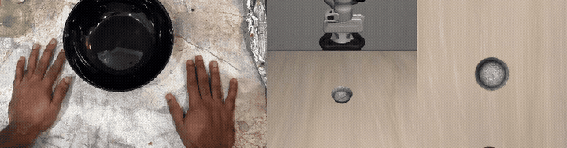
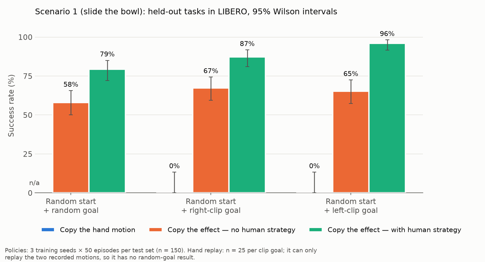
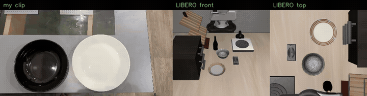
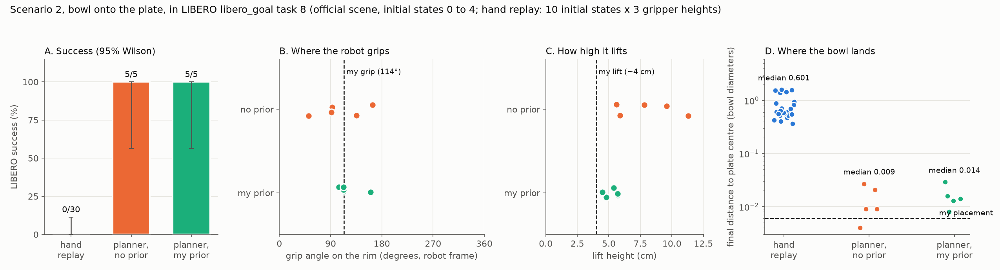

# Intent retargeting: from my phone videos to a Panda in LIBERO

I filmed my own hands moving a bowl with an iPhone, then used those clips to drive a Franka Panda in the LIBERO simulator [2]. The robot reproduces the bowl's motion as measured in the video, and it takes one detail from my technique: where on the rim I gripped.



## Main result

Replaying my hand motion on the robot never succeeds (0 of 80 tasks across both scenarios). A policy trained on demonstrations that a planner found by reproducing the bowl's motion succeeds on 96.2% of held-out tasks when the planner is seeded with my grip strategy, and on 73.6% without it (3 training seeds, 150 tasks each). SmolVLA fine-tuned on the same demonstrations, seeing only camera images, reaches 77.1% ± 0.8 (3 seeds).



## Data

I recorded three clips on an iPhone 15 Plus (4K, 30 fps, no LiDAR). Downscaled copies without audio are in [`data/clips/`](data/clips).

| Clip | Content | Camera |
|---|---|---|
| [`scenario1_right_hand.mp4`](data/clips/scenario1_right_hand.mp4) | right hand slides a black bowl away from me | fixed, top-down |
| [`scenario1_left_hand.mp4`](data/clips/scenario1_left_hand.mp4) | left hand slides it back | fixed, top-down |
| [`scenario2_bowl_onto_plate.mp4`](data/clips/scenario2_bowl_onto_plate.mp4) | left hand lifts the bowl onto a plate, then off again | hand-held |

Scenario 2 is the same task as LIBERO `libero_goal` task 8, "put the bowl on the plate".

## Method

1. Bowl tracking. The bowl is a dark disc on a light table, so a brightness threshold and a robust circle fit find it in every frame (360/360 in scenario 1, 281/281 in scenario 2). Positions are expressed in bowl diameters (D), which removes the need for a depth sensor or a known bowl size. Lift shows up as growth in the bowl's apparent size. For the hand-held clip, camera motion is estimated from the background (ORB features, RANSAC) and the bowl is measured relative to the plate, which never moves.
2. Grip strategy. MediaPipe Hands [7] gives fingertip positions, and contact with the rim gives a grip angle. In both scenario-1 clips I gripped the rim about 100° clockwise of the direction the bowl moved (−115° and −84°), even though I used different hands and moved in opposite directions. In scenario 2 I gripped the same near-left part of the rim (−162° and −151°) in both directions.
3. Planning. A cross-entropy-method planner searches over short manipulation primitives (push, pinch-and-drag, drag from inside the bowl, pick-and-place) with parallel MuJoCo rollouts, scoring each by where the bowl ends up. The grip strategy from step 2 sets the initial search distribution. The planner commands only the five action dimensions the policies output (x, y, z, yaw, gripper), so its demonstrations replay exactly. This is a simplified form of the demonstration-generation idea in MimicGen [1].
4. Distillation. The planner's successful episodes become demonstrations for a 4-layer MLP that predicts 8-step action chunks from the bowl-relative state, and for SmolVLA [3] fine-tuned from camera images, the robot's own state and the instruction "slide the black bowl onto the green target". The goal is drawn into the images as a green disc. As a robustness test, a second set of demonstrations adds Gaussian noise (σ = 0.15) to the executed actions while keeping the planner's corrective actions as labels (DART-style).
5. World model. An MLP ensemble predicts the bowl's next motion from the pinch point's position and motion relative to the bowl. It is trained on simulated robot interactions only, then given my real hand trajectory to see whether it predicts where my real bowl went.

## Results

All success rates use the same criterion: the bowl ends within 0.1 D (about 1.1 cm) of the goal and upright. All results use LIBERO's default physics. Numbers come from the JSON files in [`results/`](results).

### Scenario 1: slide the bowl

This uses a custom LIBERO scene with a table, the Panda and LIBERO's black bowl (11.2 cm).

| Method | What it uses from my video | Success |
|---|---|---|
| Replay my pinch-point trajectory, best of 3 gripper heights | hand motion and grip timing | 0/50 |
| Planner without my grip strategy (10 seeds × 2 clip goals) | goal | 20/20 |
| Planner seeded with my grip strategy (10 seeds × 2 clip goals) | goal and grip | 20/20 |
| MLP policy, demos from the planner without my strategy | goal | 73.6% ± 1.6 |
| MLP policy, demos from the seeded planner | goal and grip | 96.2% ± 1.7 |
| MLP policy, unseeded demos with action noise | goal | 81.3% ± 2.9 |
| MLP policy, seeded demos with action noise | goal and grip | 91.3% ± 0.0 |
| SmolVLA from cameras, seeded demos, 5 actions per query | goal and grip | 77.1% ± 0.8 |
| SmolVLA from cameras, seeded demos, 10 actions per query | goal and grip | 70.2% ± 3.9 |

Policy rates are means ± standard deviation over 3 training seeds, each evaluated on 150 held-out tasks (50 random goals, 50 with the right-clip goal, 50 with the left-clip goal, all from random bowl positions).

The planner solves the task with or without my grip strategy. The difference is in the demonstrations it produces: seeded with my strategy, it chose the rim pinch in 279 of 300 episodes, while without it the 300 episodes mixed rim pinches (213), drags from inside the bowl (72) and pushes (15). An MLP trained to regress actions averages across those strategies and fails more often, which accounts for the gap between 73.6% and 96.2%. The seeded policy is better for every training seed overall (141, 147, 145 vs 112, 112, 107 out of 150) and on 8 of the 9 seed and test-set combinations; the exception is random goals with seed 0 (41 vs 45 out of 50).

Action noise helps the unseeded demonstrations (73.6% to 81.3%) and slightly hurts the seeded ones (96.2% to 91.3%). Consistent demonstrations do more for this policy than the standard robustness technique.

SmolVLA is trained on all 300 seeded demonstrations (20,000 steps, batch 32, one run per seed). Executing 5 actions per query instead of 10 raises success from 70.2% to 77.1%, at about 129 ms per query (27 ms per control step). The MLP needs 0.7 ms per query.

### Scenario 2: bowl onto the plate

This uses LIBERO's official scene, its official initial states and its own success check. In my video the plate is 1.06 bowl diameters wide, the bowl came within 0.006 D of the plate centre, and I lifted it by an estimated 4 cm.

| Method | Success |
|---|---|
| Replay my pinch-point trajectory, fitted onto LIBERO's bowl and plate (10 initial states × 3 heights) | 0/30 |
| Planner seeded with my grip angle and lift height (initial states 0 to 4) | 5/5 |
| Planner without my grip strategy (initial states 0 to 4) | 5/5 |



Videos for initial states 0, 1 and 2: [`results/scenario2/robot_success_init*.mp4`](results/scenario2).



Both planners succeeded every time. The seeded planner gripped between 104° and 160° (four of five runs within 104° to 114°) and lifted 4.5 to 5.7 cm; without my strategy the grips ranged from 52° to 164° and the lifts from 5.6 to 11.3 cm. Placement precision is similar for both (median 0.014 D seeded, 0.009 D without the prior), and with five initial states per planner the success intervals are wide (57% to 100%).

### Bowl world model

Final position error after rolling the model forward over a whole episode, given only the pinch-point trajectory:

| | Demos only (33k steps) | Demos + 3,000 random interactions (159k steps) |
|---|---|---|
| Held-out robot episodes, learned model | 0.045 D | 0.067 D |
| Held-out robot episodes, "bowl follows the closed gripper" rule | 0.124 D | 0.136 D |
| My right-hand clip | 6.99 D | 4.49 D |
| My left-hand clip | 0.74 D | 0.59 D |
| My clips, "bowl does not move" | 0.43 D, 0.41 D | same |
| Ensemble disagreement, my hand / robot | 5.5× | 4.3× |

The model predicts robot interactions well, 2.8 times more accurately than the hand-coded rule. It does not predict my real bowl better than assuming the bowl stays still: individual ensemble members drift by up to 18.3 D on the right-hand clip. A model learned from a parallel gripper does not transfer to a human hand without human training data. The ensemble members disagree 4.3 to 5.5 times more on my hand input than on robot input, so the disagreement can at least flag when the model is outside its training data.

## Running it

Tested on Ubuntu 24.04, Python 3.12, an RTX 4090 Laptop GPU (16 GB) and 20 CPU cores. LIBERO and headless EGL rendering need Linux.

```bash
./scripts/setup.sh            # .venv: LeRobot, LIBERO, SmolVLA. .venv-extract: MediaPipe, OpenCV
./scripts/run_scenario1.sh    # extraction, baseline, planner, demos, policies, SmolVLA, evaluation
./scripts/run_scenario2.sh    # extraction and hand-replay baseline in libero_goal task 8
./scripts/rerun_v2.sh         # all simulation results in this README (DART comparison, both planners, world model)
./scripts/rerun_v2_vla.sh     # SmolVLA, 3 seeds; resumes from checkpoints if interrupted
./scripts/make_figures.sh     # every figure, GIF and downscaled clip in this README
```

The scripts expect the original clips in `data/raw/` (not committed, 117 MB). To watch the policy in an interactive MuJoCo window:

```bash
MUJOCO_GL=egl PYTHONPATH=src/sim .venv/bin/python src/sim/live.py --policy runs/policy_strategy_s0
```

On this machine, video extraction takes seconds, generating 300 demonstrations takes 35 to 45 minutes on 16 CPU cores, MLP training takes about a minute, and each SmolVLA run (20,000 steps) takes about 3 h 50 min.

## Code

| Path | Purpose |
|---|---|
| [`src/extract/`](src/extract) | hand landmarks, bowl and plate tracking, contact and grip angle |
| [`src/sim/env.py`](src/sim/env.py) | LIBERO wrapper: physics stepping, end-effector control, action noise, state |
| [`src/sim/planner.py`](src/sim/planner.py), [`src/sim/plate_task.py`](src/sim/plate_task.py) | primitives and CEM planners for scenarios 1 and 2 |
| [`src/sim/replay_hand.py`](src/sim/replay_hand.py), [`src/sim/replay_hand_plate.py`](src/sim/replay_hand_plate.py) | hand-motion replay baselines |
| [`src/sim/gen_demos.py`](src/sim/gen_demos.py) | planner to demonstrations, with optional action noise |
| [`src/sim/render_plate_success.py`](src/sim/render_plate_success.py) | scenario-2 success videos |
| [`src/policy/`](src/policy) | MLP policy training and evaluation |
| [`src/vision/`](src/vision) | camera dataset in LeRobot format, SmolVLA evaluation |
| [`src/worldmodel/`](src/worldmodel) | random-interaction data and the bowl world model |
| [`src/report/figures.py`](src/report/figures.py) | results and scenario-2 figures |

## Limitations

- There are only three clips, and the scenario-1 grip strategy comes from two grip angles.
- The MLP policy reads the bowl position from the simulator. SmolVLA does not, and scores lower (77.1% vs 96.2%), mostly on the right-clip goal (59%).
- Everything runs in simulation, and both tasks are short. Scenario 2 was evaluated on 5 of LIBERO's 50 initial states, and no policy was trained for it.
- Action noise was tried at a single level (σ = 0.15).
- Outcomes are sensitive to small physics differences: the same task can succeed or fail after a tiny change in the initial state. Rates are only reported over many tasks.
- Lift heights come from apparent size in a single camera. In scenario 2, slow changes in camera distance also change the apparent size by a few percent.

An earlier version of scenario 1 used a 250 g bowl instead of LIBERO's default mass; those results are kept in [`results/archive_bowl250g/`](results/archive_bowl250g) and showed the same pattern (87.6% vs 63.6%).

## Related work

ATM [4], Track2Act [5] and Im2Flow2Act [6] also learn from object or point motion in human video instead of hand poses. They predict tracks or flow with models trained on large video datasets. This project measures a single bowl directly from three clips and uses the human contribution as a goal and a search prior. MimicGen [1] generates many robot demonstrations from a few human ones by replaying object-relative segments; the planner here does something similar with a search step instead of segment replay.

## AI assistance

I used an AI coding assistant (Claude) to write and debug code and to draft this README. I recorded the data and directed the experiments, and every number above is produced by the code in this repository.

## References

1. Mandlekar, A., Nasiriany, S., Wen, B., Akinola, I., Narang, Y., Fan, L., Zhu, Y., & Fox, D. (2023). MimicGen: A data generation system for scalable robot learning using human demonstrations. *CoRL 2023*. [arXiv:2310.17596](https://arxiv.org/abs/2310.17596)
2. Liu, B., Zhu, Y., Gao, C., Feng, Y., Liu, Q., Zhu, Y., & Stone, P. (2023). LIBERO: Benchmarking knowledge transfer for lifelong robot learning. *NeurIPS 2023 Datasets and Benchmarks*. [arXiv:2306.03310](https://arxiv.org/abs/2306.03310)
3. Shukor, M., et al. (2025). SmolVLA: A vision-language-action model for affordable and efficient robotics. [arXiv:2506.01844](https://arxiv.org/abs/2506.01844)
4. Wen, C., Lin, X., So, J., Chen, K., Dou, Q., Gao, Y., & Abbeel, P. (2024). Any-point trajectory modeling for policy learning. *RSS 2024*. [arXiv:2401.00025](https://arxiv.org/abs/2401.00025)
5. Bharadhwaj, H., et al. (2024). Track2Act: Predicting point tracks from internet videos enables generalizable robot manipulation. *ECCV 2024*. [arXiv:2405.01527](https://arxiv.org/abs/2405.01527)
6. Xu, M., et al. (2024). Flow as the cross-domain manipulation interface (Im2Flow2Act). *CoRL 2024*. [arXiv:2407.15208](https://arxiv.org/abs/2407.15208)
7. Zhang, F., et al. (2020). MediaPipe Hands: On-device real-time hand tracking. *CVPR Workshop on Computer Vision for AR/VR*. [arXiv:2006.10214](https://arxiv.org/abs/2006.10214)
